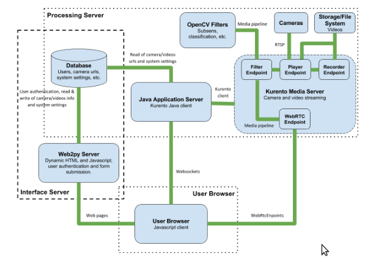
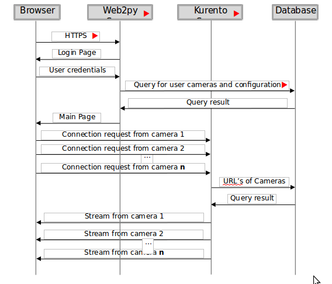

The system is composed of three main blocks:

#User Browser

This block is responsible for the communication between the computer of the user and the servers of the system. It requests the connection of the camera streams using the functions provided by the Javascript Client. Also, it allows the user to request the access to other pages of the system.

#Interface Server

This block is written in python, and is composed by Web2py Server and the Database, is responsible for the generation of the HTML and Javascript code for each one of the pages in the user interface. Also, contains the authentication methods for user login and a set of authorization tags to show only the pages the logged user is authorized to view. 

#Processing Server

Composed by the Java Application Server, Kurento Media Server and the Database, this block is in charge of connecting the cameras and stored videos to the user browser for consulting, also, this block processes the video from the cameras to find objects of interest, detect events and record videos.

#Systems sequence of messages

The following image shows the sequence of messages between the three main blocks of the system, also the messages with the database were included to show how it is shared between Web2py server and Kurento Media server. The sequence of messages begins with a HTTPS request from the user browser, Web2py server responds with the login page and after the user logins correctly web2py server delivers the structure of the page and the navigation controls and the Kurento server starts the connection with the cameras.

