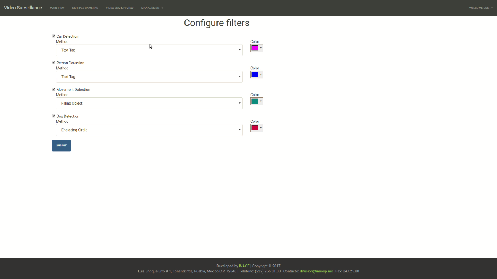

The User interface was build using the Web2Py Framework, which allows the fast development of Web Applications with Python language as it core. This framework uses the MVC (Model-View-Controller) architectural pattern to build up the web applications.

The Page Structure of the Web Application is the following:

# Login

This page forbids the access of unauthorized users to the system, blocking both view and management privileges.

# Main view

This view is composed by a container with a stream from one of the cameras connected to the system and a carousel with small views of the streams of other active cameras. The user can navigate between the streams and check the last events detected by the system, also, this interface allows the manual recording of video segments that could be of interest for the user.

![Main view Cameras] (images/viewcameras.png)

# Multiple cameras

This view is composed by a grid of nine elements (3x3) showing the cameras registered in the system, allowing the user to have a global vision of what is happening in several cameras at the same time.

# Video Search/view

This page allows the user to search segments of video associated with events detected by the system, both automatic detections and manual recordings. This interface contains a form to search by event type, by date of detection, and/or by the id of the camera in which the event was detected.

# Management

This section have to views: camera management and filters management. The first view allows the user to register new cameras and edit those already registered. The fields for registering a camera include: The Name that will identify the camera in the interface, the IP Address to obtain the stream and the Name of the Zone where the camera is located. Filters management allows to the user change the color of bounding box, enclosing circle, tex tag and filling object.

