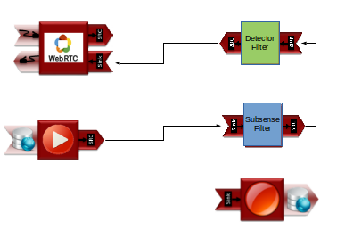
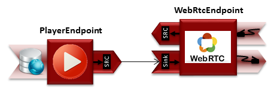

Kurento is composed by a WebRTC (Web Real-Time Communications) media server and a set of client APIs that makes simple the development of advanced video applications for WWW, it also provides advanced media processing capabilities involving computer vision. Given the above, Kurento is a fundamental tool in the ViVA Application.

Kurento also provides advanced media processing capabilities involving computer vision, video indexing, augmented reality and speech analysis. Kurento modular architecture makes simple the integration of third party media processing algorithms (i.e. speech recognition, sentiment analysis, face recognition, etc.), which can be transparently used by application developers.

For ViVA it was developed two web Applications in the Processing video architecture block, the first visualizes the video at real time and stores it, the second plays the video from the storage file system (figure 1).
Kurento is based on Media Elements and Media Pipelines that act as building blocks for application development.

Media Pipeline is a chain of media elements, where the output stream generated by one element (source) is fed into one or more other elements input streams (sinks). Hence, the pipeline represents a “machine” capable of performing a sequence of operations over a stream.

The Media Elements are the Kurento modules that allow unit performing a specific action on a media stream. Media elements are capable of receiving media from other elements (through media sources) and of sending media to other elements (through media sinks). It exist different media elements groups, but in this system is necessary just two groups:

Endpoints: Media elements capable of receiving media and  injecting it into a pipeline from hardware resource like a camera or taking media stream out the pipeline.

Filters: Media elements in charge of transforming or analyzing media with vision software.

The main Media Elements used in Kurento are the following:
WebRtcEndpoint is an output and input endpoint that provides media streaming for Real Time Communications (RTC) through the web. It implements WebRTC technology to communicate with browsers.

PlayerEndpoint is an input endpoint that retrieves content from a file system, HTTP url or RTSP url.

RecorderEndpoint is an output endpoint that provides function to store contents in reliable mode.

Kurento provides default filters that it can use like QR detector,  face detector and GStreamer. But in the video surveillance project it was necessary the development of algorithms to detect moving objects and draws a bounding box in each moving object detected, Kurento modules allow encapsulate this algorithms to use like a filter media elements.

#Streaming and Storage

In Figure 2 the media pipeline for the streaming application is shown. The PlayerEndpoint retrieves the video streaming from the cameras at real time, and it is connected to the Subsense Filter to extract the background of the scene and detect moving objects, The Detector Filter draws a bounding box in each moving object detected in Susbsense Filter. Finally, the WebRtcEndpoint shows the video in the browser at real time with the bounding boxes drawn on the object in movement. At the same time, the PlayerEndpoint is connected also to a RecorderEndpoint to store the video, this recording begins at the moment the application is started.
In the INAOE the system is working with four IP cameras, each camera have an instance of the following Media Pipeline, 

 

 The Media Elements connection of Kurento streaming and Storage Pipeline: The PlayerEndpoint send video to the WebRtcEndpont passing for the OpenCV filters and to the RecorderEndpoint to store video

This application is use in the main view and multiple cameras on the interface.

#Player 
The name of the video file is constructed using the identifier of the camera and the date and time when it was recorded, to allow the visualization of the recorded videos it was necessary the development of a second Pipeline. 

Player Kurento Media Pipeline:  WebRtcEndpoint receive the streaming from PlayerEndpoint
In this simple connection, the PlayerEndpoint inputs the video from the file path and delivers the video stream to the WebRtcEndpoint so it can connect to the browser and play the video. This is the application that allow play the video on the video search/view interface